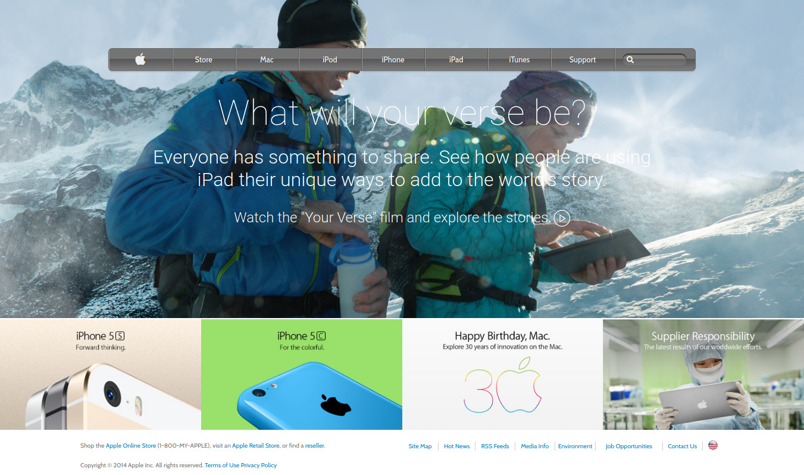

# Apple Webpage Clone

This is a project for learning purposes. This project is a clone of an old version of apple.com website.

> In this project, my goal was to improve my understanding of CSS tools and resources, such as the use of gradients and images in element backgrounds.
> I applied three different positioning techniques to the layout to achieve my goals. (Floating, Flexbox and Grid)
> In the course of the project, I improved the use of advanced CSS selectors and my code organization practices.

This project covers the following HTML and CSS3 concepts

- Floats and positioning
- The box model
- CSS Advance Selectors
- Flex and Grid
- Background gradients and images

## Built With

- HTML
- CSS
- Google fonts
- Font Awesome

## Live Demo

[Live Demo Link]()

## Author

👤 **Lucas Delbel**

- Github: [@ldelbel](https://github.com/ldelbel)
- Twitter: [@delbel_lucas](https://twitter.com/delbel_lucas)
- Linkedin: [lucasdelbel](https://www.linkedin.com/in/lucasdelbel/)

## 🤝 Contributing

Contributions, issues and feature requests are welcome!

Feel free to check the [issues page](https://github.com/acushlakoncept/newyork_times_clone/issues).

## Show your support

Give a ⭐️ if you like this project!

## Acknowledgments

- Project originally taken from The Odin Project
- Project inspired by Microverse Program
